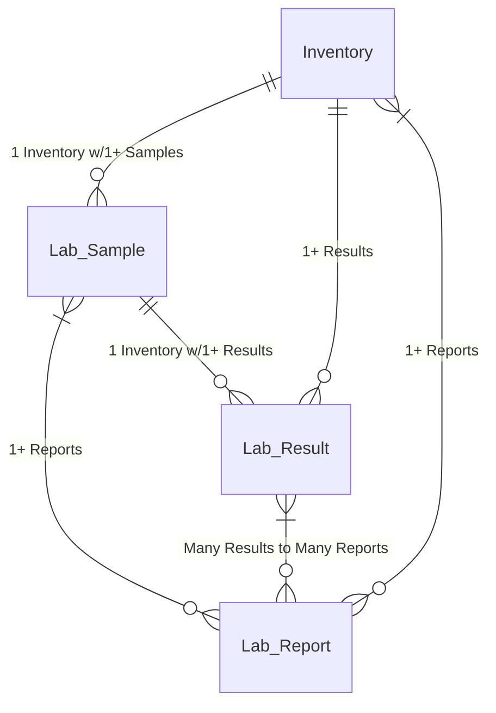
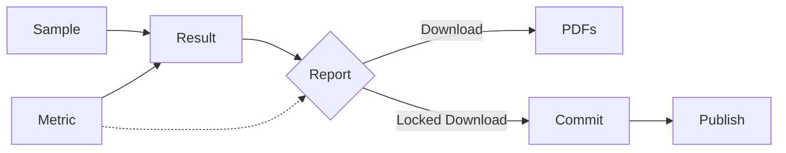

# OpenTHC Laboratory Portal

This service provides a method for all interested parties to upload and share the Cannabis Laboratory Data data.

It integrates with BioTrackTHC, Franwell/METRC and MJ Freeway/LeafData.





## Installation

Clone this repo, install dependencies, connect the database (using the CRE schema).

```shell
git clone ...
./make.sh install
```


## Install Ghostscript

```
apt install ghostscript
locate pdf_info.ps
```


# Tests for Laboratory Site

```
./test/test.sh
```


## Processes

### Intake

Using the B2B Transfer model incoming materials are record to Lab Sample type lots

Then using the Samples section one can review and annotate these items.

Enter the Lab Results for a Sample, if configured properly the system can even put the inventory materials into a connected CRE.

### Publish Results

The primary purpose of this software is for publishing and sharing the lab results.
Each is shared with a simple link and is presented to the end-users as HTML, PDF, PNG, JSON and even as as QR code.


## Alternatives

For more information check out https://wiki.openthc.org/LIMS
